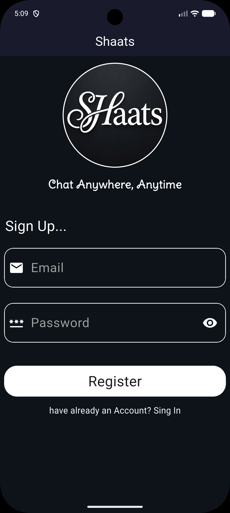
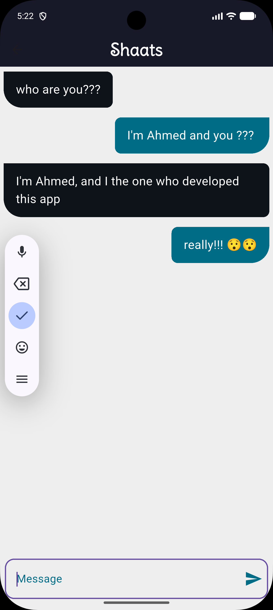
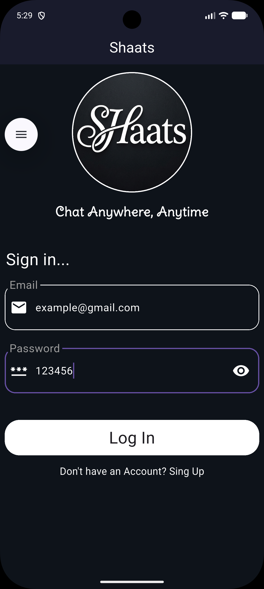
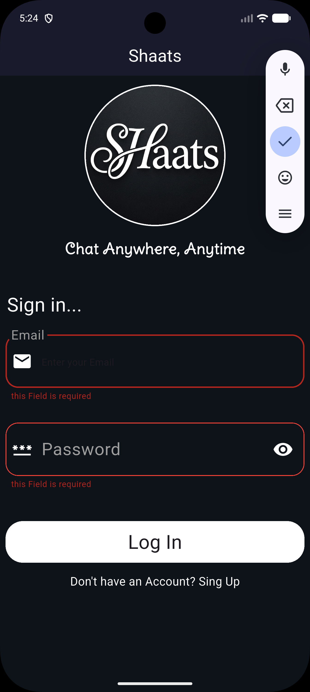
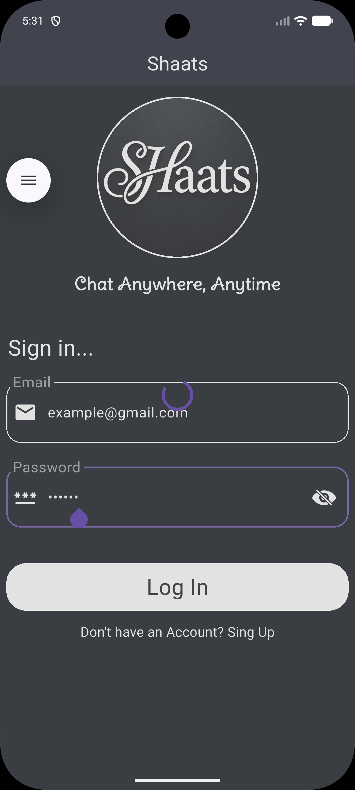

<div align="center">

# 💬 Shaats

[](https://flutter.dev)
[](https://dart.dev)
[](https://firebase.google.com)
[](LICENSE)
[](https://flutter.dev)

**A real-time chat application built with Flutter and Firebase**

[✨ Features](#-features) • [📸 Screenshots](#-screenshots) • [🏗️ Architecture](#%EF%B8%8F-architecture) • [🚀 Getting Started](#-getting-started) • [👤 Author](#-author)

</div>

---

## 🎯 Overview

**Shaats** is a real-time chat application built with Flutter and Firebase, designed to provide seamless instant messaging with a clean and modern interface. The app features real-time message synchronization, user authentication, and a responsive UI.

### 💡 Key Highlights
- 🔥 **Firebase Integration** — Real-time database with Cloud Firestore
- 🔐 **User Authentication** — Secure sign-in and sign-up with Firebase Auth
- ⚡ **Real-time Messaging** — Instant message delivery and synchronization
- 🎨 **Beautiful UI** — Clean Material Design with custom branding
- 📱 **Cross-Platform** — Works seamlessly on Android and iOS

---

## ✨ Features

### 💬 Core Features
- **Authentication** — Email and password sign-in/sign-up
- **Real-time Chat** — Live message updates using Firestore streams
- **Message History** — Persistent chat history across sessions
- **Sender & Receiver Bubbles** — Distinct message styles for sender and receiver
- **Auto-scroll** — Smooth scrolling to latest messages
- **Loading States** — Progress indicators during async operations

### ⚙️ Technical Features
- **Firebase Backend** — Cloud Firestore for messages, Firebase Auth for users
- **Stream Builder** — Real-time data synchronization
- **Modal Progress HUD** — Loading overlays during authentication
- **Form Validation** — Input validation for email and password fields
- **Custom Widgets** — Reusable UI components
- **Material Design 3** — Latest Google Material Design principles

---

## 📸 Screenshots

<div align="center">

| 🔐 Login | 📝 Sign Up | 💬 Chat |
|:--------:|:----------:|:-------:|
|  |  |  |
| User authentication | Account creation | Send messages |

| 🔒 Secure Password | 🔓 Unsecure Password | ⚠️ Error |
|:----------------:|:------------------:|:------:|
|  |  |  |
| Password hidden | Password visible | Error handling |

| ⏳ Loading | 🎨 Others |
|:----------:|:---------:|
|  |  |
| Loading state | Other points |

</div>

---

## 🛠️ Technical Stack

<div align="center">

| Component | Technology | Version | Purpose |
|:---------:|:----------:|:-------:|:-------:|
| **Framework** | Flutter | Stable | Cross-platform UI |
| **Language** | Dart | 3.x | Programming |
| **Backend** | Firebase | Latest | Backend services |
| **Auth** | Firebase Auth | ^6.4.0 | User authentication |
| **Database** | Cloud Firestore | ^6.3.0 | Real-time database |
| **State Mgmt** | setState | Built-in | UI state handling |
| **Icons** | Material Icons | Built-in | System icons |
| **Design** | Material Design 3 | Latest | UI/UX guidelines |

</div>

---

## 🏗️ Architecture

### 📁 Project Structure

```
lib/
├── main.dart                        # Application entry point
│
├── Models/                          # 📊 Data Models
│   └── Message_Model.dart           # Message data structure
│
├── Views/                           # 🎬 UI Screens
│   ├── Sing_In_View.dart            # Sign-in screen
│   ├── Sing_Up_View.dart            # Sign-up screen
│   └── Chat_View.dart               # Chat screen
│
├── Widgets/                         # 🧩 Reusable UI Components
│   ├── Button_Widget.dart           # Custom button widget
│   ├── Custom_Form_Text_Field.dart  # Text input field
│   ├── Logo_Widget.dart             # App logo widget
│   ├── Message_Space.dart           # Message input area
│   ├── Password_Text_Feild.dart     # Password input field
│   ├── Reciver_Massage.dart         # Receiver message bubble
│   └── Sender_Massage.dart          # Sender message bubble
│
├── helper/                          # 🛠️ Helper Utilities
│   ├── Constants.dart               # App-wide constants
│   └── show_Snack_Bar.dart          # Snackbar helper
│
└── firebase_options.dart            # 🔥 Firebase configuration
```

### 🔄 Data Flow

```
┌─────────────────┐     ┌──────────────────┐     ┌─────────────────┐
│   SignInView    │────▶│  Firebase Auth   │────▶│   ChatView      │
│  (email/pass)   │     │  (signInWith...) │     │  (email arg)    │
└─────────────────┘     └──────────────────┘     └─────────────────┘
                                                          │
                                                          ▼
┌─────────────────┐     ┌──────────────────┐     ┌─────────────────┐
│  MessageModel   │◀────│  Firestore Query │◀────│  StreamBuilder  │
│ (message, id)   │     │  (collection)    │     │  (snapshots)    │
└─────────────────┘     └──────────────────┘     └─────────────────┘
                                                          │
                                                          ▼
                                                  ┌─────────────────┐
                                                  │ SenderMassage   │
                                                  │ ReceiverMassage │
                                                  └─────────────────┘
```

**Navigation:** Named routes for screen transitions
```dart
// Route definitions
routes: {
  SignInView.id: (context) => SignInView(),
  SignUpView.id: (context) => SignUpView(),
  ChatView.id: (context) => ChatView(),
}
```

---

## 🎨 Design System

### Color Palette
| Element | Hex Code | Color | Usage |
|:--------|:--------:|:-----:|:------|
| **Primary** | `#0E131A` | Dark Navy | App background, AppBar |
| **Sub Color** | `#016C86` | Teal | Accent elements |
| **Background** | `#E5E5E5` | Light Gray | Chat background |
| **Surface** | `#FFFFFF` | White | Cards, input fields |
| **Text Primary** | `#FFFFFF` | White | AppBar text, buttons |
| **Text Secondary** | `#000000` | Black | Snackbar text |

### Typography
- **Font:** DeliusSwashCaps (custom font)
- **App Title:** Bold, 25-28pt, White
- **Slogan:** Bold, 22pt, White, DeliusSwashCaps
- **Section Headers:** 28pt, White
- **Body Text:** 17pt, White
- **Message Text:** System default

---

## 🧩 Data Models

### MessageModel
```dart
class MessageModel {
  final String message;
  final String id;

  MessageModel(this.message, {required this.id});

  factory MessageModel.fromJson(jsonData) {
    return MessageModel(jsonData[kMessage], id: jsonData["id"]);
  }
}
```

### Constants
```dart
const kPrimaryColor = Color(0xff0E131A);
const kSubColor = Color(0xff016C86);
const kLogo = "assets/Shaats_Logo.png";
const kCollection = "Messages";
const kMessage = "message";
const kCreatedAt = "CreatedAt";
```

---

## 📦 Dependencies

```yaml
dependencies:
  flutter:
    sdk: flutter
  cupertino_icons: ^1.0.8
  firebase_core: ^4.7.0
  firebase_auth: ^6.4.0
  modal_progress_hud_nsn: ^0.5.1
  firebase_storage: ^13.3.0
  cloud_firestore: ^6.3.0
  firebase_ui_auth: ^3.0.1
  provider: ^6.1.5+1

dev_dependencies:
  flutter_test:
    sdk: flutter
  flutter_lints: ^6.0.0
```

```bash
flutter pub get
```

---

## 🚀 Getting Started

### 📋 Prerequisites

| Requirement | Version | Purpose |
|:-----------:|:-------:|:-------:|
| Flutter SDK | >=3.11.4 | Framework |
| Dart SDK | >=3.0.0 | Language |
| Firebase Project | Latest | Backend |
| Android Studio / Xcode | Latest | Emulators |
| Git | Latest | Version control |

### 🔥 Firebase Setup

1. Create a new Firebase project at [firebase.google.com](https://firebase.google.com)
2. Add Android/iOS app to your Firebase project
3. Download `google-services.json` (Android) or `GoogleService-Info.plist` (iOS)
4. Place in appropriate platform directories
5. Enable **Authentication** (Email/Password) and **Cloud Firestore**

### 💻 Installation

```bash
# 1. Clone repository
git clone https://github.com/ahmed-el-bialy/shaats.git
cd shaats

# 2. Install dependencies
flutter pub get

# 3. Run application
flutter run

# Build for production
flutter build apk --release      # Android APK
flutter build appbundle --release # Android AAB
flutter build ios --release       # iOS
```

---

## ⚠️ Known Limitations

| Issue | Details | Status |
|:------|:--------|:------:|
| No message timestamps display | CreatedAt stored but not shown | 🔧 Planned |
| No user profile images | Default avatar only | 🔧 Planned |
| No push notifications | Requires Firebase Messaging | 🔧 Planned |
| No message deletion | Cannot delete sent messages | 🔧 Planned |
| No typing indicators | Real-time typing status missing | 🔧 Planned |

---

## 🔮 Roadmap

- [ ] **Message Timestamps** — Show message sent time
- [ ] **User Profiles** — Profile pictures and status
- [ ] **Push Notifications** — Firebase Cloud Messaging
- [ ] **Message Reactions** — Emoji reactions to messages
- [ ] **Image Sharing** — Send images via Firebase Storage
- [ ] **Dark Mode** support
- [ ] **Group Chats** — Multi-user conversations
- [ ] **Message Search** — Search chat history
- [ ] **Widget & unit tests**
- [ ] **CI/CD** with GitHub Actions

---

## 🤝 Contributing

Contributions are welcome!

1. **Fork** the repository
2. **Create** a feature branch: `git checkout -b feature/amazing-feature`
3. **Commit** changes: `git commit -m 'feat: Add amazing feature'`
4. **Push** to branch: `git push origin feature/amazing-feature`
5. **Open** a Pull Request

---

## 📄 License

This project is licensed under the **MIT License** — see the [LICENSE](LICENSE) file for details.

---

## 👤 Author

**Ahmed El-Bialy**
*Flutter Developer | Mobile App Specialist*

<div align="center">

[](https://www.linkedin.com/in/ahmedel-bialy/)
[](mailto:ah.elbialy.dev@gmail.com)
[](tel:+201022121573)
[](https://github.com/ahmed-el-bialy)

</div>

📧 **Email:** ah.elbialy.dev@gmail.com
📞 **Phone:** +20 102 212 1573

---

<div align="center">

### ⭐ Star this repo if you found it helpful!

**Built with ❤️ by Ahmed El-Bialy**

</div># Shaats
